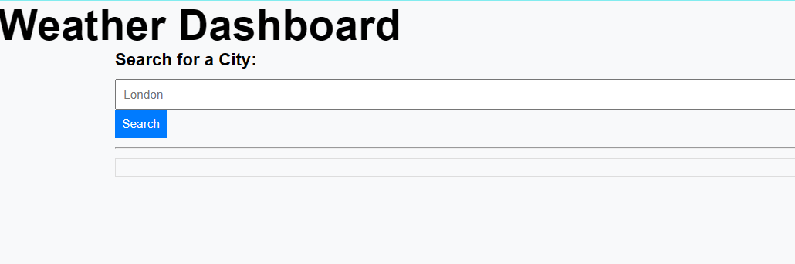

# Edxbootcamp_Module8challege

## Description
This challenge is to bulid a weather dashboard that will run in the browser and feature dynamically updated 
HTML and CSS. In order to display the data, API should be used from the openweathermap.org

## Task needed to achieve this module

* Create a weather dashboard with form inputs.

* When a user searches for a city they are presented with current and future conditions for that city and    that city is added to the search history.

* When a user views the current weather conditions for that city they are presented with:

    * The city name
    * The date
    * An icon representation of weather conditions
    * The temperature
    * The humidity
    * The wind speed

* When a user views future weather conditions for that city they are presented with a 5-day forecast that displays:

    * The date
    * An icon representation of weather conditions
    * The temperature
    * The humidity

* When a user clicks on a city in the search history they are again presented with current and future conditions for that city.

## Installation

N/A

## Usage 

openweathermap.org

(https://api.openweathermap.org/data/2.5/forecast?lat={lat}&lon={lon}&appid={API key}.)

## Output of the website

## Link to deployed application

(https://kurresailakshmareddy.github.io/edxbootcamp_Module8challege/)

## License

none
